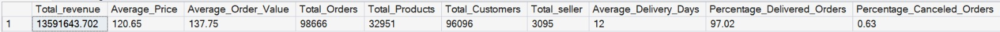
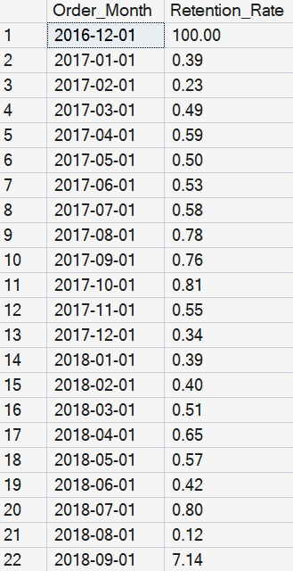
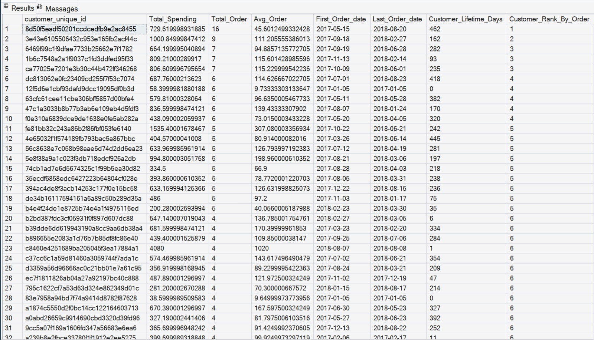
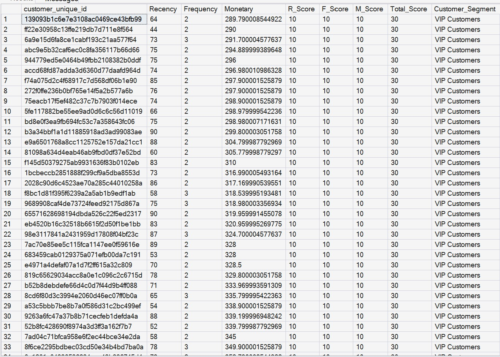
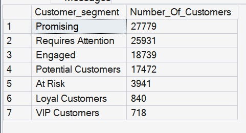
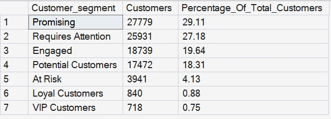
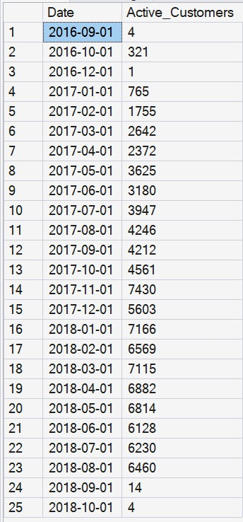
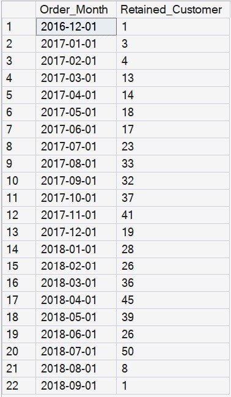
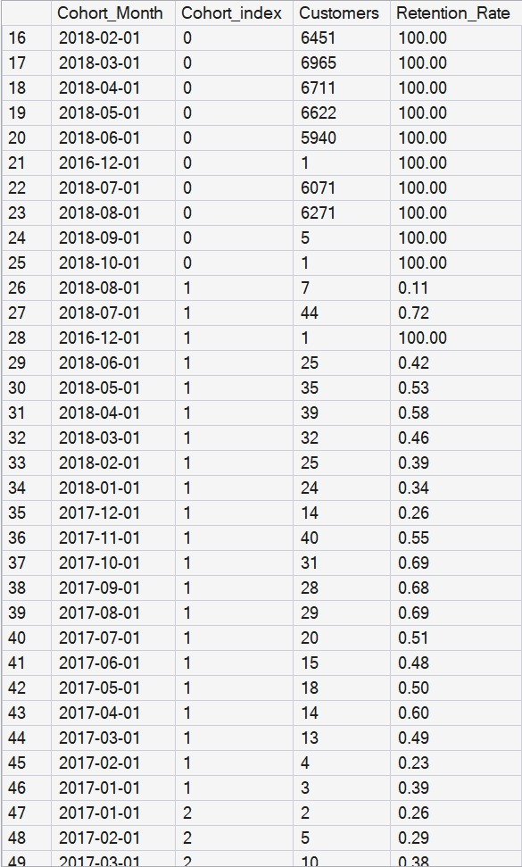
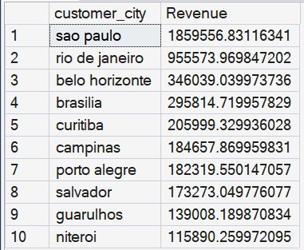

# E-Commerce Customer Behavior & Retention Analysis (SQL Project)

## Project Overview
This project focuses on analyzing customer behavior, retention, sales performance, and customer segmentation using SQL Server and the Brazilian E-Commerce Dataset (Olist).

The analysis covers:
- Sales Performance Analysis
- Customer Retention Analysis
- Cohort Analysis
- Repeat Purchase Analysis
- RFM Customer Segmentation
- Customer Lifetime Analysis
- Revenue by City
- Business KPIs

---

## Project Screenshots

### KPIs Overview

---

### Repeat Purchase Rate

---

### Customer Lifetime Analysis

---

### RFM Customer Segmentation

---

### Customer Segments Distribution

---

### Customer Segments Percentage

---

### Active Customers Trend

---

### Retained Customers Analysis

---

### Cohort Analysis

---

### Revenue by City

## SQL Skills & Techniques Used

- Common Table Expressions (CTEs)
- Views
- Window Functions
- Subqueries
- Aggregate Functions
- GROUP BY & HAVING
- INNER JOIN
- Self Join Logic
- CASE WHEN Statements
---

## Dataset
Dataset used:
- Brazilian E-Commerce Public Dataset by Olist (Kaggle)

Main tables used:
- customers_dataset
- orders_dataset
- order_items_dataset
- products_dataset
- sellers_dataset

---

## Key KPIs
- Total Revenue
- Average Order Value (AOV)
- Average Product Price
- Total Orders
- Total Customers
- Total Products
- Total Sellers
- Average Delivery Days
- Delivered Orders Percentage
- Canceled Orders Percentage

---

## Project Analysis

### 1. Sales Analysis
- Revenue trends
- Top revenue-generating cities
- Order performance analysis

### 2. Customer Analysis
- Active customers over time
- Repeat customers analysis
- Customer lifetime analysis

### 3. Retention Analysis
- Monthly retention tracking
- Repeat purchase behavior
- Cohort retention analysis

### 4. RFM Segmentation
Customers were segmented into:
- VIP Customers
- Loyal Customers
- Engaged
- Potential Customers
- Promising
- Requires Attention
- At Risk

---

## Business Insights
Key findings from the analysis are available in:
- `Insights.md`

---

## SQL Functions Used

- LEAD()
- RANK()
- DENSE_RANK()
- ROW_NUMBER()
- COUNT()
- SUM()
- AVG()
- MIN()
- MAX()
- DATEDIFF()
- DATEFROMPARTS()
- CAST()
- ROUND()

---

## Project Goals
The goal of this project is to:
- Practice advanced SQL concepts
- Build a portfolio-ready data analysis project
- Extract business insights from raw transactional data
- Analyze customer retention and purchasing behavior

---

## Author
 Mohamed Hesham 
- Aspiring Data Analyst passionate about SQL, Power BI, and Business Analytics.
